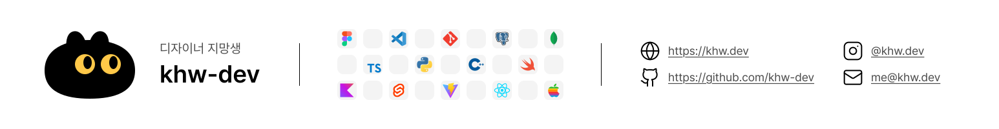

# Hi there! 👋

I enjoy creating responsive web designs and web applications.

  <picture>
    <source media="(prefers-color-scheme: dark)" srcset="banner/dark.svg">
    <source media="(prefers-color-scheme: light)" srcset="banner/light.svg">
    
  </picture>

## Links

- [Email](mailto:me@khw.dev)
- [Github](https://github.com/khw-dev)
- [Portfolio](https://khw.dev)
- [Instagram](https://www.instagram.com/khw.dev)

## Copyright

- Unless otherwise stated in an individual repository, my original source code and other original content are all rights reserved.
- Public availability does not grant permission to copy, modify, distribute, sublicense, or commercially use the content.
- Third-party components remain subject to their respective licenses.
